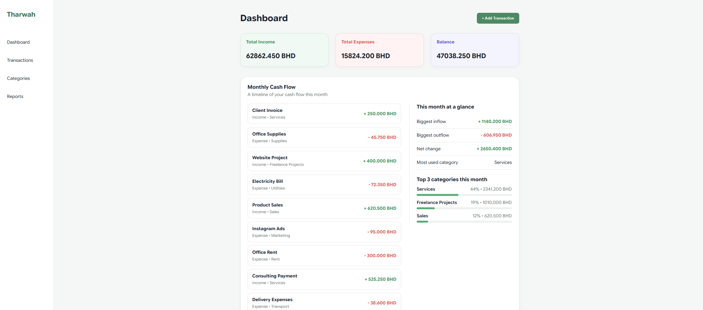
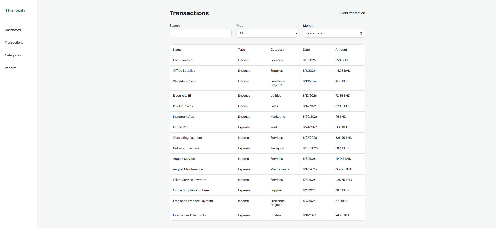
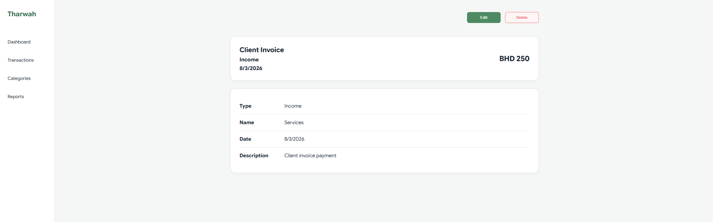
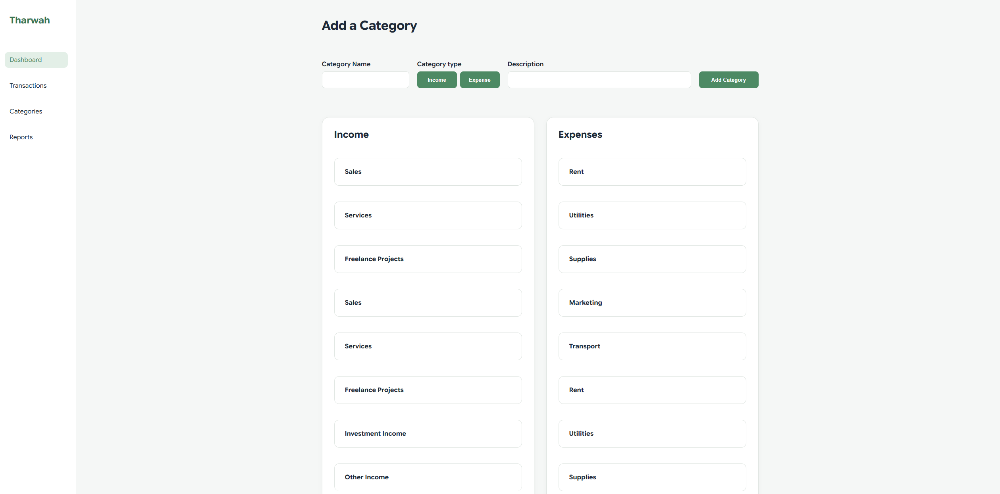
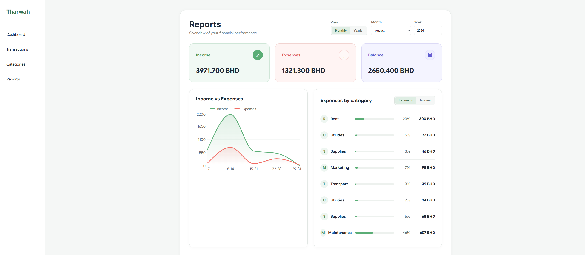
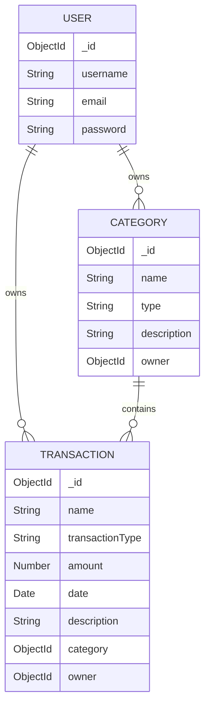

# Tharwah

Tharwah is a full-stack cash-flow management application designed to help small businesses easily track their income and expenses, organize financial transactions, and understand their overall financial performance.

The application provides users with a clear dashboard, transaction management tools, customizable categories, and financial reports to make day-to-day cash-flow management simpler and more organized.

This project was developed by **Husain Almajed** and **Jassim Mohammed** as part of a full-stack MERN application.

---

## Application Screenshots

### Dashboard

The dashboard provides a quick overview of the business's financial position, including total income, total expenses, current balance, recent cash-flow activity, and key monthly insights.



### Transactions

Users can view all of their transactions in one place and filter them using search, transaction type, and month.



### Transaction Details

Each transaction has its own details page displaying the transaction type, category, date, description, and amount. Users can also edit or delete transactions from this page.



### Categories

Users can create and manage custom income and expense categories, allowing transactions to be organized based on the needs of their business.



### Reports

The reports page gives users a deeper view of their financial performance through monthly and yearly reports, income and expense comparisons, and category-based breakdowns.



---

## Features

- Secure user authentication using JWT.
- User-specific financial data and ownership authorization.
- Create, view, edit, and delete transactions.
- Create, edit, and delete income and expense categories.
- Organize transactions using custom categories.
- Search transactions by name.
- Filter transactions by type and month.
- Dashboard showing:
  - Total income
  - Total expenses
  - Current balance
  - Monthly cash-flow activity
  - Biggest inflow and outflow
  - Most-used categories
- Monthly and yearly financial reports.
- Income vs. expense visualization.
- Financial breakdown by category.
- Responsive and consistent user interface.
- Custom 404 page for invalid routes.

---

## ERD

The application uses three main database models: **User**, **Category**, and **Transaction**.



### Relationships

- A **User** can own multiple transactions.
- A **User** can create multiple categories.
- Each **Transaction** belongs to one user.
- Each **Transaction** is assigned to one category.
- Each **Category** belongs to one user.

---

## Technologies Used

### Frontend

- React
- React Router
- JavaScript
- HTML
- CSS
- Vite
- Recharts

### Backend

- Node.js
- Express.js
- MongoDB
- Mongoose
- JSON Web Tokens
- bcrypt

---

## Backend Repository

The backend for Tharwah is maintained in a separate repository:

[Tharwah Backend Repository](https://github.com/HusainAlmajed/Tharwah-Project-Back-End)

---

## Getting Started

### 1. Clone the Repository

```bash
git clone https://github.com/HusainAlmajed/Tharwah-Project-Front-End.git
```

### 2. Navigate Into the Project

```bash
cd Tharwah-Project-Front-End
```

### 3. Install Dependencies

```bash
npm install
```

### 4. Create an Environment File

Create a `.env` file in the root directory and add the backend server URL:

```env
VITE_BACK_END_SERVER_URL=your_backend_url
```

For local development, this may look similar to:

```env
VITE_BACK_END_SERVER_URL=http://localhost:3000
```

### 5. Start the Development Server

```bash
npm run dev
```

The application will then run through the Vite development server.

---

## Project Structure

```text
src/
├── assets/
├── components/
├── pages/
├── services/
├── App.jsx
├── App.css
├── index.css
└── main.jsx
```

### Main Pages

- `Dashboard` - Displays financial summaries and monthly cash-flow information.
- `TransactionList` - Displays and filters all transactions.
- `TransactionDetails` - Displays information about a specific transaction.
- `TransactionForm` - Handles creating and editing transactions.
- `CategoryForm` - Handles creating and editing categories.
- `CategoryDetails` - Displays information about an individual category.
- `Report` - Displays financial reports and visualizations.
- `SignUpForm` - Handles account registration.
- `SignInForm` - Handles user authentication.
- `NotFound` - Handles invalid application routes.

---

## Future Enhancements

### Budgeting

Introduce budgeting tools that allow users to create monthly spending limits for different categories and compare their actual spending against their planned budget.

### Export Financial Data

Allow users to export their transactions and financial reports into formats such as CSV, making it easier to store, analyze, or share their financial information.

---

## Developers

### Husain Almajed

GitHub: [HusainAlmajed](https://github.com/HusainAlmajed)

### Jassim Mohammed

GitHub: [Jassiiimm](https://github.com/Jassiiimm)

Developed in collaboration as part of the Tharwah MERN-stack project.

---

## About the Project

Tharwah was created to provide small businesses with a straightforward way to understand and manage their cash flow.

Rather than only recording transactions, the application focuses on turning financial data into useful information through dashboards, categories, cash-flow summaries, and visual reports.